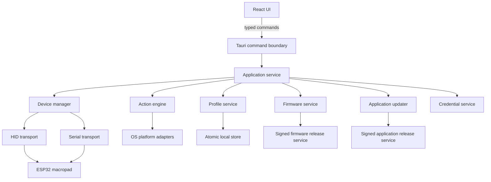

# System Architecture

## Decision

Build a new Tauri 2 application with:

- **Rust core:** device I/O, action execution, persistence, updater orchestration, permissions, logging, and platform adapters.
- **React + TypeScript + Vite UI:** configuration, virtual controls, status, lighting, and update experiences.
- **Versioned device protocol:** HID for normal operation; serial ROM bootloader for recovery-oriented firmware flashing.
- **Target-OS CI builds:** Windows, macOS, and Linux runners with signing and hardware smoke-test gates.

Electron + TypeScript remains the fallback if Rust ownership is unavailable. The legacy Electron modules are not migrated wholesale.

## Context

The current prototype directly combines Electron lifecycle, HID access, action dispatch, dialogs, persistence, and renderer events. It has incorrect process imports, unsafe renderer privileges, duplicated connection logic, incomplete features, and no tests. Its valuable assets are product behavior, VID/PID values, provisional command IDs, profile concepts, and imagery.

## Component model



## Repository target layout

```text
src/                         React application
  app/                       routing, providers, application shell
  features/                  device, profiles, actions, lighting, updates
  components/                reusable UI components
  design/                    tokens and theme bindings
  api/                       generated/typed Tauri facade
src-tauri/
  src/
    application/             use cases and orchestration
    domain/                  device, profile, action, update models
    infrastructure/
      hid/                   HID adapter
      serial/                serial adapter
      persistence/           atomic profile/settings storage
      platform/              windows, macos, linux adapters
      updates/               app and firmware update adapters
    commands/                narrow Tauri command/event surface
  capabilities/              Tauri capability allowlists
  icons/
packages/
  schemas/                   JSON Schemas and generated TS types
  protocol-fixtures/         binary packet fixtures shared with firmware tests
docs/
plans/
```

## Runtime boundaries

### UI boundary

The UI receives serializable view models and emits validated intents. It cannot receive raw device handles or arbitrary filesystem paths. Long operations expose progress events and cancellation tokens.

Representative commands:

```text
list_devices() -> DeviceSummary[]
connect_device(device_id) -> OperationId
save_profile(ProfileDraft) -> Profile
execute_binding(binding_id, source) -> ExecutionReceipt
preview_lighting(device_id, LightingDraft) -> Result
start_firmware_update(device_id, release_id) -> OperationId
cancel_operation(operation_id) -> Result
```

### Application and domain layers

The application layer coordinates use cases, permissions, and state transitions. The domain layer contains no Tauri, UI, transport, or OS dependencies. It defines devices, capabilities, profiles, pages, bindings, triggers, action graphs, lighting, permissions, and update state.

### Infrastructure layer

Infrastructure implements ports for HID, serial, OS actions, persistence, credentials, and release services. Platform code is selected at compile time behind common Rust traits.

## Concurrency and ownership

- One device actor/task owns each connected HID handle.
- A device command queue serializes output reports.
- Input reports are parsed and emitted through a bounded channel.
- Action executions run in supervised tasks with cancellation and timeouts.
- Firmware flashing obtains an exclusive device lease and suspends reconnect attempts.
- UI subscriptions are observers; hiding the window does not stop the background service.
- Shutdown drains profile writes and releases device handles before exit.

## Device identity

Use a stable application-level `DeviceId`, derived from a firmware serial number when available. USB path is ephemeral and must not identify a profile. Without a unique serial, combine immutable device identity with an explicit pairing step.

## Persistence

Start with versioned JSON documents plus JSON Schema because the data volume is small. Reconsider SQLite only if searchable history or synchronization makes document storage awkward.

Atomic save:

1. Serialize and validate the next document.
2. Write to a sibling temporary file.
3. Flush it.
4. Replace the destination atomically where supported.
5. Retain one last-known-good backup.

Documents:

- `settings.json`
- `devices/<device-id>.json`
- `profiles/<profile-id>.json`

Profile migrations are ordered pure transformations with fixture tests. Legacy import is isolated from normal loading.

## Profile model

```text
Profile
  id, schemaVersion, name, icon, applicationRules[]
  pages[]
    id, name, parent?, bindings{}
      controlId + trigger -> ActionGraph
  lightingPolicy
  virtualDeckLayout
```

## Startup lifecycle

1. Acquire the single-instance lock.
2. Initialize logging, crash recovery, settings, and profile indexes.
3. Initialize tray and window services.
4. Start device discovery and state observers.
5. Start automatic profile selection after permissions are known.
6. Check for updates after startup settles and a status surface exists.
7. Closing the window hides it; explicit Quit stops background operation.

## Failure policy

- Hardware absence is normal, not an error dialog.
- Recoverable failures appear in context with Retry and diagnostic details.
- Reconnect uses bounded exponential backoff with jitter.
- Invalid packets are counted and discarded; repeated violations quarantine the connection.
- Failed actions never crash device input processing.
- Corrupt user files are preserved and recovered from backup/defaults.
- Update failures never silently retry destructive phases.

## Remaining architecture decisions

- Direct `espflash` library use versus a pinned sidecar executable.
- Final confirmation or revision of the provisional release baseline in `PLATFORM-SECURITY.md` after dependency prototypes.
- JSON documents versus SQLite if profile/history scope grows materially.
