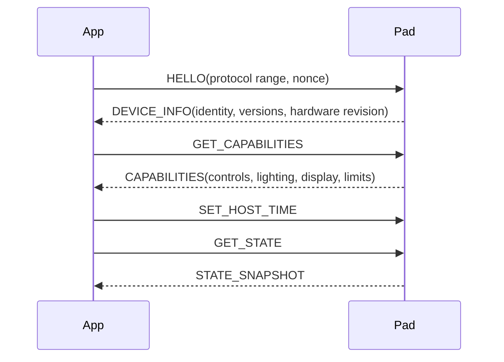

# Device Protocol Specification

Status: Draft; firmware confirmation required

## Goals

- Preserve existing input semantics while making the protocol versioned and extensible.
- Negotiate capabilities instead of assuming LEDs, display, controls, or report sizes.
- Support state synchronization, diagnostics, and safe transition into update mode.
- Reject malformed, stale, unsupported, or device-incompatible messages.

## Existing observations

The legacy code opens HID VID `12346`, PID `4097`. Input byte 0 appears to identify six buttons (`0..5`) and two rotary logical controls (`6..7`); byte 1 identifies an action. Output command `0xD0` sends date fields and `0xD1` sends time fields. These are observations, not yet a frozen contract.

## Transport and envelope

- HID is the normal runtime transport.
- Serial is reserved for ROM bootloader flashing unless firmware defines an application serial protocol.
- Report ID and payload size are negotiated or defined per hardware revision.
- Multibyte integers use little-endian order.

Proposed logical envelope:

```text
magic       u8
version     u8
messageType u8
flags       u8
sequence    u16
length      u16
payload     bytes
checksum    u16 | omitted if report constraints require it
```

If the HID report is too small, use a compact v1 envelope and fragmentation. Exact encoding is blocked on report-size confirmation.

## Handshake



No action execution begins until identity and compatibility are established.

## Required device information

- Stable serial or pairing identifier
- Product and hardware revision
- Firmware semantic version and build identifier
- Protocol minimum/current version
- Bootloader/update method
- Controls and input events
- Lighting topology and effects
- Display capability, if any
- Maximum payload and update rate

## Input event

```text
INPUT_EVENT
  controlId: u16
  event: PRESS | RELEASE | SHORT | LONG | DOUBLE | HOLD_REPEAT |
         ROTATE_LEFT | ROTATE_RIGHT | ROTATE_FAST_LEFT | ROTATE_FAST_RIGHT
  value: i16 optional
  deviceTimestamp: u32
```

Firmware should preferably emit raw `PRESS`, `RELEASE`, and rotary deltas. The desktop derives gestures consistently. If firmware derives gestures, capability flags prevent duplicate interpretation.

## Command families

### Core

- `HELLO`, `DEVICE_INFO`, `GET_CAPABILITIES`, `GET_STATE`
- `ACK`, `ERROR`, `PING`, `PONG`, `REBOOT`
- `ENTER_BOOTLOADER` only if firmware/hardware can do it safely

### Time and display

- `SET_DATE` (`0xD0` legacy mapping candidate)
- `SET_TIME` (`0xD1` legacy mapping candidate)
- `SET_DISPLAY_MODE`, `SET_DISPLAY_VALUE`, `SET_DISPLAY_BRIGHTNESS`

### Lighting

- `GET_LIGHTING_STATE`, `PREVIEW_LIGHTING`, `COMMIT_LIGHTING`
- `SET_STATUS_INDICATOR`

Lighting uses capability-advertised effect IDs and parameter schemas. Unknown effects are rejected without changing current state.

### Diagnostics

- `GET_DIAGNOSTICS`, `DIAGNOSTIC_EVENT`
- `FACTORY_RESET` with physical and user confirmation

## Reliability

- State-changing commands use sequence-correlated ACK/ERROR.
- Retry only idempotent commands, with a bounded count.
- Preview lighting may be lossy and supersede older previews.
- State commits acknowledge only after firmware persistence succeeds.
- Time sync repeats after reconnect and host clock changes.

## Compatibility

- Major incompatibility blocks configuration but may permit a compatible recovery update.
- Minor additions are capability-gated.
- Deprecated commands have a documented transition window.
- Desktop and firmware share golden binary fixtures.
- A legacy adapter is added only if devices cannot be upgraded first.

## Security and testing

HID is local but untrusted. Validate lengths, indexes, identifiers, enum values, strings, and rates. Acceptance tests cover golden fixtures, fuzz decoding, truncation, unknown messages, sequence wrap, disconnect during ACK, duplicates, ordering, flooding, and approved legacy behavior.
