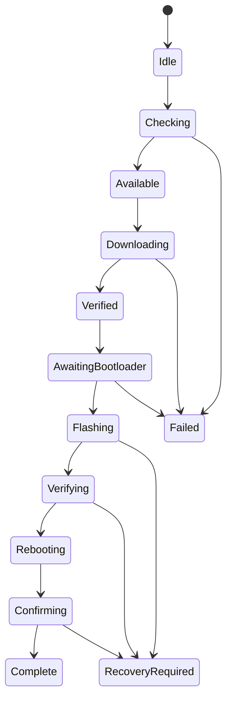

# Firmware Update and Recovery Design

## Objective

Download a firmware release, verify publisher authenticity and device compatibility, place the ESP32 in its ROM serial bootloader, write all declared images, verify them, reboot, and confirm the expected running version.

## Preconditions

- Exact ESP32 family and flash layout are known.
- Firmware build produces reproducible binaries and a machine-readable flash layout.
- Device reports stable hardware and firmware identity during normal operation.
- Release signing public key is embedded in the desktop application.
- At least one manual recovery path remains available through BOOT0/GPIO0.

## Signed manifest

Illustrative structure:

```json
{
  "schemaVersion": 1,
  "releaseId": "firmware-3.1.0-hwA-<content-digest>",
  "version": "3.1.0",
  "channel": "stable",
  "chip": "esp32",
  "hardwareRevisions": ["A"],
  "protocol": { "min": 2, "max": 2 },
  "minimumDesktopVersion": "3.0.0",
  "segments": [
    { "name": "bootloader", "offset": "0x1000", "url": "...", "size": 0, "sha256": "..." },
    { "name": "partition-table", "offset": "0x8000", "url": "...", "size": 0, "sha256": "..." },
    { "name": "application", "offset": "0x10000", "url": "...", "size": 0, "sha256": "..." }
  ],
  "releaseNotes": "...",
  "signedAt": "2026-07-19T00:00:00Z",
  "expiresAt": "2026-10-19T00:00:00Z",
  "signature": {
    "algorithm": "Ed25519",
    "keyId": "firmware-stable-2026-01",
    "value": "base64-signature"
  }
}
```

Offsets shown are examples, not project truth. The firmware build owns actual offsets. Each artifact is hash-verified after download.

### Trust and canonicalization contract

- The desktop embeds a pinned offline root public key and a signed keyset containing delegated release keys, key IDs, validity periods, allowed channels/hardware families, and revocations.
- Manifests use RFC 8785 JSON Canonicalization Scheme. The Ed25519 signature covers the canonical UTF-8 document with the `signature` member omitted.
- `releaseId` is immutable and includes or maps one-to-one to the canonical manifest digest. Published manifests/artifacts are never replaced at the same URL.
- A separately signed channel pointer maps `stable`, `beta`, or `canary` to an immutable release ID. A manifest signed for one channel cannot be replayed into another.
- Reject unknown/revoked keys, invalid delegation, expired metadata, future-skewed `signedAt`, mismatched channel, and manifest digest mismatch.
- Record the highest successfully installed version per device/hardware line. Reject lower or equal versions unless an explicit recovery/downgrade flow is enabled and device anti-rollback policy permits it.
- Root-key rotation requires a new keyset signed by the currently trusted root or an explicit desktop application update. Compromise response can revoke delegated release keys without replacing the root.
- Offline recovery bundles contain a signed manifest and remain usable according to a separately documented recovery-expiry policy; normal online installs require non-expired metadata.

## Workflow



Detailed sequence:

1. Obtain exclusive device lease and snapshot identity.
2. Fetch manifest over HTTPS with size/time limits.
3. Verify signature, schema, version policy, hardware/chip compatibility, and segment ranges.
4. Download to an application-owned temporary directory.
5. Verify exact sizes and SHA-256 values.
6. Suspend HID reconnect and close the device.
7. Attempt automatic bootloader entry only when advertised.
8. Otherwise show illustrated manual steps: hold BOOT, reset/connect, release when detected.
9. Enumerate serial changes and require an unambiguous candidate or user selection.
10. Ask the ROM bootloader for chip identity; compare it to the manifest.
11. Write segments in the declared order and stream progress.
12. Verify flash by supported checksum/readback mechanism.
13. Reset or instruct the owner to reset.
14. Resume HID discovery and confirm device identity plus new version.
15. Record a redacted result and remove temporary artifacts.

## Safety invariants

- No erase/write before signature, hash, schema, chip, hardware, and range validation pass.
- A manifest cannot address outside configured flash size or overlap segments unexpectedly.
- Downgrades require an explicit recovery mode, a compatible signed recovery artifact, and respect device anti-rollback policy.
- Cancellation is allowed before erase/write; during flashing it becomes “stop after safe boundary” where supported.
- Application exit is blocked or strongly warned during destructive phases.
- Sleep inhibition is requested during flashing where supported.
- Recovery instructions are bundled offline.
- The app never asks the user to install Python.

## Flasher implementation decision

Prototype two approaches behind a `FirmwareFlasher` Rust trait:

1. Integrate the Rust `espflash` library if its public API and supported chips meet requirements.
2. Otherwise bundle pinned, signed `espflash` or Espressif tooling sidecars per target platform and parse a stable machine-readable wrapper protocol.

Do not shell-interpolate ports or paths. Pass arguments as arrays and validate sidecar checksums at build and runtime.

## Failure and recovery UX

- **Device not found:** repeat the exact BOOT/RESET sequence with port troubleshooting.
- **Wrong chip/device:** stop before write and identify the mismatch.
- **Download/integrity failure:** discard artifacts; installed firmware is untouched.
- **Disconnect during write:** show Recovery required and restart from verified local artifacts.
- **Verification failure:** do not report success; offer a full retry.
- **New firmware does not reconnect:** retain recovery mode and diagnostic export.

## Release pipeline

Firmware CI must build artifacts, run firmware tests, generate the manifest from build metadata, canonicalize and sign it in a protected job, publish artifacts immutably, then run a physical-device install/boot/protocol smoke test before signing and promoting the channel pointer.

## Test matrix

- Every supported hardware revision and flash size
- Automatic and manual bootloader entry
- Windows/macOS/Linux serial enumeration
- Slow, interrupted, and corrupt downloads
- Wrong signature, hash, chip, revision, offset, and version
- Disconnect at each phase
- Application crash/restart during each non-destructive phase
- Successful recovery after interrupted write
- Secure boot/flash encryption configurations if enabled
