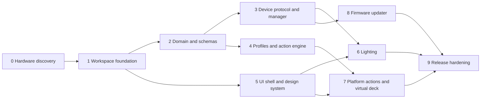

# MacroPad v3 Construction Plan

Status: Ready after hardware discovery  
Delivery mode: Direct changes until a Git worktree/remote is available  
Target: Tauri 2 + Rust + React/TypeScript desktop application and compatible ESP32 firmware protocol

## Objective

Replace the legacy Electron prototype with a secure, tested, cross-platform control platform containing all existing behavior plus microphone/multimedia control, shortcuts, macro composition, virtual buttons, pages/profiles, lighting configuration, signed desktop updates, and recoverable firmware flashing.

## Global invariants

- Main remains usable at every merged step.
- React never receives unrestricted native capabilities.
- Profiles and release metadata are schema-validated.
- Existing device behavior is preserved through fixtures or an explicit compatibility adapter.
- No firmware write occurs without verified identity, compatibility, signature, and hashes.
- Platform gaps are surfaced, not hidden.
- New modules have tests proportional to failure impact.

## Dependency graph

Steps 3, 4, and 5 can proceed in parallel after their dependencies. Steps 6–8 can partially parallelize when contracts are frozen.

## Step 0 — Hardware discovery and recovery proof

**Context:** Desktop code alone cannot establish chip, flash, USB, lighting, display, or bootloader truth. Freezing assumptions here can brick devices.

**Phase A — read-only discovery:**

- Inspect the firmware repository, board schematic/BOM, partition table, and build output.
- Record ESP32 variant, chip revision, flash size/mode/frequency, USB bridge, VID/PID, serial identity, HID descriptors/report sizes, GPIO0/EN/DTR/RTS wiring, LEDs, display, and boot behavior.
- Capture current HID input/output fixtures and observed reconnect behavior.
- Run the current app against hardware and record every working feature.
- Decide whether firmware can be upgraded before the desktop migration.

**Phase B — recovery proof before any write:**

- Obtain an authoritative known-good firmware bundle and flash layout from the firmware build/release source.
- Read and archive device identity, eFuses/security state, flash ID, and a full flash backup where hardware security policy permits it.
- Verify backup size/hash and store it outside temporary build directories.
- Document the manual BOOT/RESET sequence and prove the ROM bootloader can be detected without erasing or writing.
- Review whether secure boot, flash encryption, or anti-rollback makes backup restoration invalid or dangerous.
- Only after the recovery procedure and authoritative artifacts are approved, perform a controlled write on a designated development device and verify boot/protocol behavior.

**Verification:** Phase A uses read-only identity/descriptor/flash-ID commands and decoded report captures. Phase B verifies backup integrity, bootloader detection, recovery instructions, artifact provenance, and security policy before the first controlled flash. The controlled flash must restore normal boot and desktop communication.

**Exit criteria:** Hardware capability worksheet and protocol fixtures are reviewed; a known-good signed or provenance-verified recovery bundle exists; manual bootloader entry is proven; flash/security policy is understood; recovery is rehearsed on a designated development unit.

**Rollback:** Phase A performs no writes. Phase B uses the approved recovery bundle and procedure; production/personal devices are not used for the first write.

## Step 1 — Workspace and Tauri foundation

**Context:** Establish build, process, and permission boundaries before feature code.

**Tasks:**

- Scaffold Tauri 2, React, strict TypeScript, Vite, Rust workspace, formatter, linter, tests, and schema package.
- Add single-instance, tray, hide/show, explicit quit, autostart setting, structured logging, and crash-safe startup.
- Configure minimal Tauri capabilities and a strict CSP.
- Add target-OS CI checks and unsigned development packaging.
- Validate the provisional OS/CPU baseline and package-specific update mechanisms from `docs/PLATFORM-SECURITY.md`; record changes before feature work depends on them.
- Keep the legacy app launchable until replacement parity is reached.

**Verification:** Format, lint, typecheck, Rust/TS unit tests, production frontend build, Tauri build on each OS, and capability snapshot test.

**Exit criteria:** Empty shell starts, hides/restores, exits cleanly, holds one instance, and exposes no unrestricted native API.

**Rollback:** Remove new workspace directories; legacy application remains untouched.

## Step 2 — Domain, schemas, and typed command boundary

**Context:** All parallel feature work depends on stable device/profile/action/update contracts.

**Tasks:**

- Implement domain types and legal state machines.
- Define JSON Schemas for settings, profiles, action graphs, device capability snapshots, firmware manifests, IPC payloads, and the mandatory legacy `hidconfig.json` import fixture/mapping.
- Generate TypeScript types/facades from authoritative schemas.
- Define Rust ports for device, persistence, platform actions, credentials, app updater, and firmware flasher.
- Add size/depth/rate constraints and error taxonomy.

**Verification:** Schema fixture tests including real legacy profiles, property tests for state transitions, compile-time trait mocks, and invalid payload corpus.

**Exit criteria:** UI and infrastructure teams can build against reviewed contracts without importing each other.

**Rollback:** Version schemas before breaking changes; no user data exists yet.

## Step 3 — Device protocol and connection manager

**Context:** Replace polling/duplicated HID code with a supervised actor and negotiated protocol.

**Tasks:**

- Implement packet codec, handshake, identity, capabilities, input events, ACK/ERROR, time sync, and legacy adapter if approved.
- Implement discovery, stable device identity, exclusive handles, reconnect backoff, command queue, bounded event channel, and quarantine.
- Add virtual transport and captured fixtures.
- Expose typed device summaries/events to the UI.

**Verification:** Unit/fuzz tests, virtual disconnect/reorder/flood scenarios, sleep/reconnect test, and physical-device handshake on all target OSes.

**Exit criteria:** Input events and state remain correct through disconnects; malformed reports cannot crash the application.

**Rollback:** Feature flag the new manager and retain legacy compatibility until firmware adoption is proven.

## Step 4 — Profiles, migrations, and action engine

**Context:** Create the extensible behavior core before implementing the OS action catalog.

**Tasks:**

- Implement atomic profile/settings storage, backups, import/export, mandatory tested legacy importer, migrations, and recovery.
- Implement triggers, action registry, graphs, concurrency, cancellation, held-action safety, variables, feedback, permission calculation, and redacted history.
- Add profile/page/folder/layer selection and foreground-rule precedence.
- Provide mock actions for UI and testing.

**Verification:** Forced-termination save tests, corrupt/malicious import tests, graph depth/concurrency properties, held-action disconnect tests, and migration fixtures.

**Exit criteria:** Declarative profiles survive restart and execute deterministic mock graphs without unsafe code.

**Rollback:** Preserve last-known-good documents and maintain backward migrations only where safe.

## Step 5 — UI shell and design system

**Context:** Build reusable, accessible editor primitives against mocks while hardware work proceeds.

**Tasks:**

- Implement tokens, typography, shell, navigation, resizable editor panels, device canvas, action library, inspector, status surfaces, dialogs, activity center, and undo/redo.
- Implement schema-driven action fields and non-drag alternatives.
- Add first-run, empty, disconnected, permission, incompatible, and recovery states.
- Build visual regression and accessibility tests.

**Verification:** Component tests, keyboard-only journeys, automated accessibility checks, contrast/token validation, screenshots at minimum/recommended widths, and reduced-motion checks.

**Exit criteria:** User can create and edit a complete mock profile with no mouse and no clipped content at 960 × 640.

**Rollback:** Tokens and components are additive; route incomplete features behind flags.

## Step 6 — Lighting and device feedback

**Context:** Lighting depends on negotiated firmware capability and final UI primitives.

**Tasks:**

- Add firmware lighting commands/state and capability schemas.
- Implement global/per-key controls only as advertised.
- Separate throttled preview from acknowledged persistent commit.
- Add status policies for mute, recording, profile/page, connection, and update.
- Resolve feedback precedence and restore user lighting after temporary status.

**Verification:** Rate-limit tests, capability permutations, disconnect during preview/commit, persistence restart, and physical LED color/effect tests.

**Exit criteria:** Unsupported controls never appear; previews are responsive; committed state survives reboot.

**Rollback:** Lighting commands are optional/capability-gated; disable status overrides independently.

## Step 7 — Platform actions and virtual deck

**Context:** Deliver the main product value through well-labeled OS adapters.

**Tasks:**

- Implement keyboard/mouse, application/file/URL, volume, microphone, media, window, notification, clipboard, and timer actions.
- Implement push-to-talk/mute with prior-state restoration and disconnect timeout.
- Add endpoint observation and device feedback.
- Implement the resizable, touch/keyboard-accessible, always-on-top virtual deck.
- Add permission education and platform availability probes.

**Verification:** Adapter unit tests, OS integration tests, mic external-state observation, held key/mic disconnect recovery, shortcut collision tests, and virtual-deck E2E.

**Exit criteria:** Essential v1 actions work on each supported OS or show a precise unavailable/degraded reason.

**Rollback:** Adapters are independently feature-flagged; failed adapters cannot block configuration.

## Step 8 — Firmware and application updates

**Context:** Updates are privileged supply-chain and device-recovery boundaries.

**Tasks:**

- Implement signed firmware manifest verification, artifact download/cache, compatibility/range checks, exclusive update state machine, flasher adapter, progress, recovery, and post-update confirmation.
- Prototype direct `espflash` integration versus pinned sidecar and record the decision.
- Implement signed Tauri updates with defer/restart/error behavior: NSIS on Windows, direct signed bundle on macOS, AppImage replacement on Linux, and notification/package-manager handoff for deb/store builds.
- Create canary metadata and local/mock update servers.

**Verification:** Negative signature/hash/chip/revision/offset tests, interruption at every phase, successful physical update/recovery, desktop upgrade from previous signed version, packaging-mode updater selection tests, deb/store non-self-update tests, and post-package signature checks.

**Exit criteria:** A deliberately corrupted or incompatible update cannot reach write/install; interrupted firmware can be recovered with bundled guidance.

**Rollback:** Firmware uses manual bootloader recovery; desktop rollback is a higher version release, never artifact mutation.

## Step 9 — Migration, release hardening, and launch

**Context:** Replace the legacy app only after parity, recovery, and distribution evidence exists.

**Tasks:**

- Run the already-implemented legacy importer and feature-parity checklist against release-candidate builds; no new legacy mapping is deferred to this step.
- Remove unused dependencies/assets and archive legacy code after a tagged fallback release.
- Finalize signing, notarization, Linux rules/packages, app/firmware channels, diagnostics, support documentation, privacy statement, and licenses.
- Run canary/beta rollout, collect opt-in diagnostics, fix blockers, and promote stable.

**Verification:** Clean-machine installs/uninstalls, upgrade from legacy/current stable, permission reset, multi-device, sleep/resume, offline use, signature verification, SBOM/audit, hardware matrix, and recovery drill.

**Exit criteria:** All release gates in `docs/QUALITY-RELEASE.md` pass; the owner approves stable promotion; a higher-version emergency fix can be published.

**Rollback:** Stop stable promotion or publish a higher fixed version. Preserve legacy installer/profile backups for the documented transition window.

## Plan mutation protocol

- New scope is inserted as a numbered substep or new step with dependencies and exit criteria.
- A step may split only if contracts and ownership boundaries remain explicit.
- Skipped steps require documented accepted risk and owner approval.
- Architecture changes update the design documents before implementation resumes.
- Every mutation records date, reason, affected dependencies, migration impact, and rollback change.

## Immediate next action

Execute Step 0 with access to the firmware repository, schematic or board details, and at least one physical macropad. Steps 1 and 5 may start using mock capabilities while discovery proceeds, but protocol/flashing contracts must not be frozen early.
